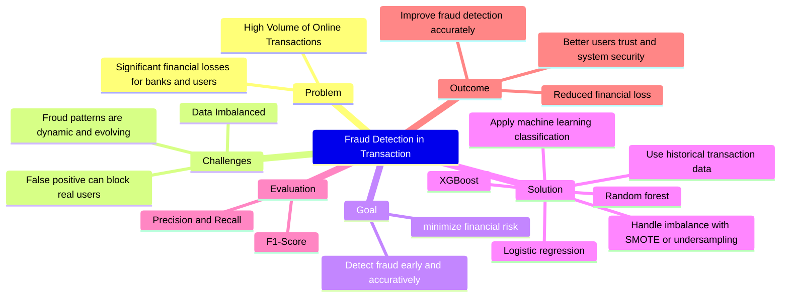

```mermaid
mindmap
Fraud Detection in Transaction
  Problem
    High Volume of Online Transactions
    Significant financial losses for banks and users
  Challenges
    Data Imbalanced
    Froud patterns are dynamic and evolving
    False positive can block real users
  Goal
    Detect fraud early and accuratively
    minimize financial risk
  Solution
    Use historical transaction data
    Apply machine learning classification
    Random forest
    XGBoost
    Logistic regression
    Handle imbalance with SMOTE or undersampling
  Evaluation
    Precision and Recall
    F1-Score
  Outcome
    Improve fraud detection accurately
    Reduced financial loss
    Better users trust and system security 
```
