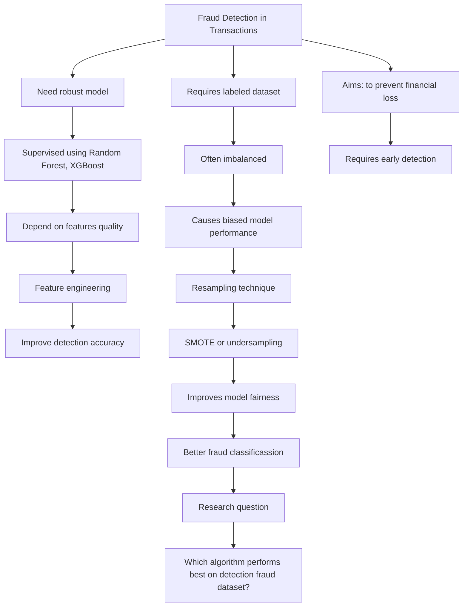

```mermaid
graph TD;
  A[Fraud Detection in Transactions] --> B[Requires labeled dataset]
  B --> C[Often imbalanced]
  C --> D[Causes biased model performance]

  A --> E[Need robust model]
  E --> F[Supervised using Random Forest, XGBoost]
  F --> G[Depend on features quality]

  A --> H[Aims: to prevent financial loss]
  H --> I[Requires early detection]

  G --> J[Feature engineering]
  J --> K[Improve detection accuracy]

  D --> L[Resampling technique]
  L --> M[SMOTE or undersampling]

  M --> N[Improves model fairness]
  N --> O[Better fraud classificassion]

  O --> P[Research question]
  P --> Q["Which algorithm performs best on detection fraud dataset?"]
```
